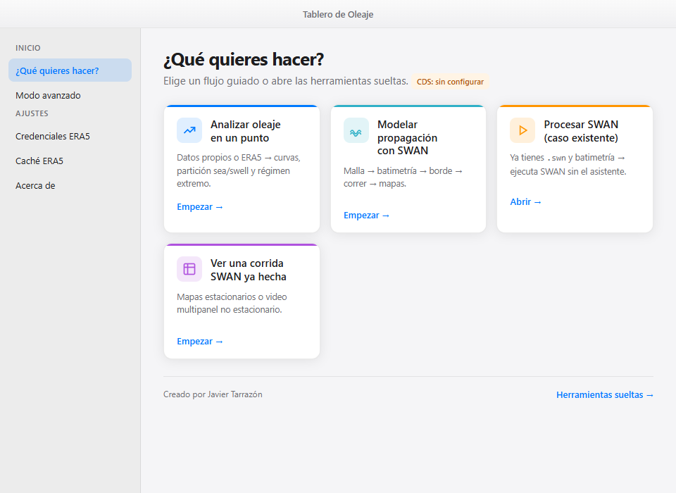
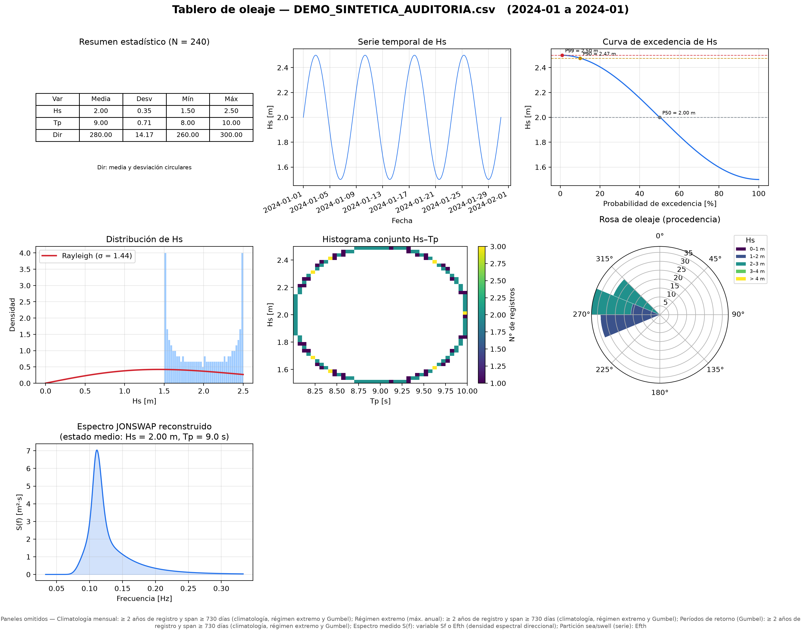

# Tablero Oleaje

**Análisis de oleaje y modelación costera con SWAN, desde una aplicación de escritorio.**

Tablero Oleaje reúne la carga de datos, la revisión de series, la preparación de
casos SWAN y la visualización de resultados en una interfaz guiada. Permite
transformar series de oleaje en tableros de gráficos y explorar simulaciones
estacionarias o la evolución temporal de un evento mediante mapas y videos.

[Qué puedes hacer](#qué-puedes-hacer) · [Instalación](#instalación) ·
[Probar un ejemplo](#prueba-con-el-ejemplo-incluido) · [Documentación](#documentación)



## Qué puedes hacer

La pantalla de inicio ofrece cuatro formas de trabajar:

| Flujo | Qué permite hacer | Resultado |
|---|---|---|
| **Analizar oleaje en un punto** | Cargar una serie `.mat`, `.csv` o `.nc`, o solicitar datos de ERA5; revisar variables y comparar Hs con una serie de referencia. | Tablero de curvas y estadísticas en PNG. |
| **Modelar propagación con SWAN** | Definir una malla por latitud/longitud, preparar la batimetría y el borde, y ejecutar un caso con un dominio anidado opcional. | Archivos del modelo y mapas de resultados. |
| **Procesar SWAN — caso existente** | Seleccionar una carpeta con sus archivos de entrada y ejecutar el modelo, con registro de progreso y cancelación. | Resultados de la corrida SWAN. |
| **Ver una corrida SWAN ya hecha** | Cargar resultados compatibles e identificar si corresponden a una simulación estacionaria o no estacionaria. | Tablero de mapas o video de la evolución del oleaje. |

Los productos se adaptan a las variables y a la duración del registro. Cuando
faltan datos para un panel, la app indica el motivo y genera los productos que
sí están disponibles.

### Gráficos y archivos de salida

- **Series de oleaje:** resumen de altura significativa (Hs), período de pico
  (Tp) y dirección; evolución temporal, climatología, excedencia, rosa de oleaje
  y análisis exploratorio de extremos mediante Gumbel.
- **Espectros:** representación direccional y partición en familias cuando se
  dispone de un espectro 2D. El espectro JONSWAP reconstruido se identifica como tal.
- **Resultados SWAN:** mapas de Hs, dirección y otras variables disponibles,
  además de animaciones para corridas no estacionarias.
- **Exportación:** gráficos PNG, series convertidas a NetCDF y videos MP4 con
  ffmpeg; GIF para animaciones pequeñas cuando ffmpeg no está disponible.

<details>
<summary><strong>Ver un tablero generado con datos de ejemplo</strong></summary>



El ejemplo es **sintético** y sirve para comprobar el funcionamiento. Los paneles
de climatología y extremos se omiten porque el registro es corto.

</details>

## Instalación

### Windows — versión actual del repositorio

**[Descargar el código actualizado en ZIP](https://github.com/shysam1/tablero-oleaje-SWAN/archive/refs/heads/master.zip)**

1. Instala [Python](https://www.python.org/downloads/windows/) de **64 bits** y
   habilita la opción **Add python.exe to PATH**. La combinación comprobada en
   la auditoría es Windows con **Python 3.13**; los lanzadores admiten 3.11 o superior.
2. Extrae el ZIP completo en una carpeta donde puedas guardar archivos, por
   ejemplo dentro de Documentos.
3. Abre **`iniciar_windows.bat`** con doble clic.
4. Espera la preparación inicial. El lanzador crea el entorno `.venv`, instala
   las dependencias y abre la aplicación.

También puedes iniciarla desde PowerShell, dentro de la carpeta extraída:

```powershell
.\iniciar_windows.bat
```

La primera preparación requiere internet. Las siguientes aperturas reutilizan
el entorno instalado; trabajar con archivos locales no requiere una cuenta ERA5.
La ventana utiliza [Microsoft Edge WebView2](https://developer.microsoft.com/microsoft-edge/webview2/).
Si falta ese componente, debe instalarse para abrir la interfaz.

> **Qué incluye esta descarga:** el código y los recursos de la aplicación.
> Todavía requiere Python y la instalación inicial de librerías. El instalador
> de [la release v1.0.1](https://github.com/shysam1/tablero-oleaje-SWAN/releases/tag/v1.0.1)
> es una versión anterior y no incorpora las correcciones de septiembre de 2026.

### Herramientas opcionales

| Herramienta | Cuándo se necesita |
|---|---|
| **SWAN**, con `swanrun` accesible | Para ejecutar modelos. Puedes analizar series y visualizar corridas existentes sin instalarlo. |
| **ffmpeg** | Para exportar videos MP4 y trabajar con animaciones largas. |
| **Cuenta Copernicus CDS y token personal** | Para descargar ERA5 desde la app. Se configura en **Credenciales ERA5**. |

### macOS

El repositorio incluye `iniciar_mac.command` y una
[guía de uso para macOS](GUIAS%20DE%20USO/GUIA%20DE%20USO%20MAC.txt).
Los scripts fueron revisados, pero la versión actual **todavía no se ha probado
en un equipo macOS**. No hay un DMG actualizado validado para esta revisión.

## Prueba con el ejemplo incluido

Puedes obtener tu primer tablero sin descargar datos externos:

1. Abre **Analizar oleaje en un punto**.
2. Selecciona **Tengo un archivo** y carga
   [`ejemplos/oleaje_demo_sintetico.csv`](ejemplos/oleaje_demo_sintetico.csv).
3. Avanza a **Revisión** para consultar las variables, los controles físicos y
   los productos disponibles.
4. Continúa a **Tablero** y pulsa **Generar tablero**.

La app mostrará una vista previa y guardará el PNG. El archivo contiene 240
registros artificiales separados cada tres horas; **no representa observaciones
ni una simulación física**. Su formato se describe en
[`ejemplos/LEEME.txt`](ejemplos/LEEME.txt).

## Datos y resultados

Los tableros, videos y series exportadas se guardan normalmente en `salidas/`,
dentro de la carpeta de la aplicación. Si esa ubicación no permite escritura,
se utiliza la carpeta de datos del usuario. **Acerca de** muestra la ruta
efectiva y permite abrirla. Los archivos del modelo y los resultados de la
corrida SWAN permanecen en la carpeta del caso elegida.

Para tus propios datos, usa las columnas y unidades del ejemplo como referencia.
Los lectores `.mat` y `.nc` esperan estructuras compatibles con las documentadas
en el proyecto; la extensión por sí sola no garantiza compatibilidad.

Las series de entrada deben usar **convención náutica de procedencia**: grados
desde el norte, indicando de dónde viene el oleaje. Es también la convención de
los bordes generados; el lector de archivos propios no detecta ni convierte
automáticamente otras convenciones. Para una corrida SWAN con coordenadas
locales, revisa también su origen UTM antes de interpretar la ubicación de los mapas.

## Estado y alcance

En la [auditoría del 22 de septiembre de 2026](docs/AUDITORIA_2026-09-22.md)
se aprobaron **255 pruebas**. La verificación incluyó una instalación en un
entorno limpio, apertura en WebView2, generación de un tablero desde la interfaz,
lectura de datos históricos y dos corridas SWAN con casos sintéticos.

Las pruebas se realizaron en el mismo computador de desarrollo con Windows y
Python 3.13 de 64 bits. Queda pendiente comprobar la instalación en otro equipo
y cuenta sin administrador. El conjunto de versiones utilizado está registrado
en [`requirements-windows-py313.lock`](requirements-windows-py313.lock).

Antes de aplicar los resultados a un estudio, considera estos límites:

- **Formatos SWAN:** se comprobaron los archivos generados por la app y los
  casos históricos de referencia. Otros formatos de fondo, disposiciones de
  datos o geometrías requieren revisión; el lector no cubre cualquier corrida.
- **ERA5:** cada usuario necesita su propia cuenta y los términos del dataset
  aceptados. La petición espectral actualizada sigue pendiente de una descarga
  autenticada real.
- **Interpretación de ingeniería:** los controles automáticos y las pruebas de
  software no sustituyen la revisión de la calidad del registro, la suficiencia
  de datos para extremos ni la calibración y validación del modelo.

## Documentación

| Recurso | Contenido |
|---|---|
| [Léeme primero](LEEME%20PRIMERO.txt) | Orientación para abrir la aplicación desde una carpeta. |
| [Guía de Windows](GUIAS%20DE%20USO/GUIA%20DE%20USO%20WINDOWS.txt) | Requisitos, inicio y resolución de problemas habituales. |
| [Guía de macOS](GUIAS%20DE%20USO/GUIA%20DE%20USO%20MAC.txt) | Instrucciones del lanzador disponible para ese sistema. |
| [Auditoría integral](docs/AUDITORIA_2026-09-22.md) | Correcciones, evidencia de pruebas y mejoras pendientes. |
| [Ejemplo de entrada](ejemplos/LEEME.txt) | Columnas, unidades y uso del CSV sintético. |

Si encuentras un problema, puedes
[abrir una incidencia](https://github.com/shysam1/tablero-oleaje-SWAN/issues)
indicando sistema operativo, versión de Python, pasos para reproducirlo y
mensaje de error. Adjunta un ejemplo de datos que puedas compartir y omite
tokens, credenciales o información privada de los registros.

<details>
<summary><strong>Desarrollo y pruebas</strong></summary>

La interfaz de escritorio usa **pywebview** y HTML/CSS/JavaScript; el motor de
análisis utiliza Python, xarray, NumPy, SciPy y Matplotlib.

| Componente | Archivos principales |
|---|---|
| Interfaz y puente Python | `app_web.py`, `ui/`, `api_web.py`, `motor_web.py` |
| Series y productos | `io_oleaje.py`, `validacion.py`, `productos.py`, `tablero_oleaje.py` |
| ERA5 y espectros | `io_era5.py`, `particion_espectral.py`, `productos_particion.py` |
| Preparación y ejecución SWAN | `geo_malla.py`, `io_batimetria.py`, `borde_oleaje.py`, `swan_builder.py`, `swan_runner.py` |
| Lectura y visualización SWAN | `io_swan.py`, `io_swan_nonst.py`, `productos_swan.py`, `tablero_swan.py`, `video_swan.py` |

Desde PowerShell, después de preparar el entorno:

```powershell
.\.venv\Scripts\python.exe -m pip install pytest
.\.venv\Scripts\python.exe -m pytest -q --capture=sys --basetemp="$env:USERPROFILE\pytest-tablero"
```

Los tests con datos históricos requieren `TABLERO_DATOS_SWAN` y
`TABLERO_DATOS_OLEAJE`. `TABLERO_PROBAR_SWAN=1` activa las dos corridas sintéticas
con el ejecutable real. Los tests de interfaz requieren Playwright y Chromium.
Sin esos recursos, los casos correspondientes se omiten; el comando básico no
reproduce por sí solo las 255 pruebas de la auditoría.

Para crear una entrega filtrada usa `empaquetar_entrega.bat`. Los archivos se
seleccionan mediante [`scripts/archivos_entrega.txt`](scripts/archivos_entrega.txt),
excluyendo resultados, preferencias y entornos locales. Las fuentes del
instalador Windows se compilan con `empaquetar_instalador.bat` e Inno Setup.

</details>

---

Desarrollada por **Javier Tarrazón** en el contexto de su formación en Ingeniería
Civil en la Universidad de Concepción. Proyecto de desarrollo asistido por IA,
con revisión técnica y comprobaciones documentadas.
